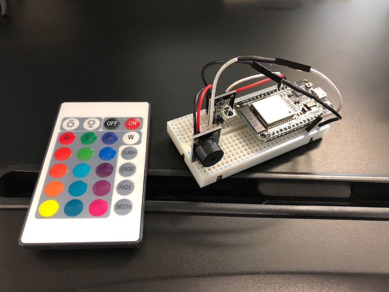

# ESP32 LIFX IR Remote

Project to control lights via the LIFX api by reading IR signals via an ESP32 microcontroller.

## The problem

LIFX does not produce a remote control that is compatible with it's bulbs.
Third party remotes/switches require a ZigBee hub or bluetooth connection to a smartphone, neither of these are ideal.

## The solution

Using an IR remote, IR receiver and an ESP32 development board we can control the LIFX bulbs via the API.

## Getting started

### Hardware

- ESP32
- IR receiver component
- IR remote
- Buzzer component (optional)

### secrets.h

Rename the `secrets.example.h` file to `secrets.h` and update the variables accordingly.
An explanation of these variables can be found below

| Secret                | Usage                                                                                             |
| --------------------- | ------------------------------------------------------------------------------------------------- |
| `WIFI_SSID`           | SSID of your WiFi network                                                                         |
| `WIFI_PASSWORD`       | Password for the WiFi network                                                                     |
| `LIFX_TOKEN`          | Your LIFX personal access token, to generate one visit https://cloud.lifx.com/settings            |
| `LIFX_BULB_ID`        | your LIFX bulb ID or selector, for more details see https://api.developer.lifx.com/docs/selectors |
| `ROOT_CA_CERTIFICATE` | A valid certificate within the LIFX API certificate chain                                         |

Other non-secret variables to consider are:

| Variable   | Beep                                                                          |
| ---------- | ----------------------------------------------------------------------------- |
| `BEEP`     | When set to true the a beep will be played upon recognising a valid IR signal |
| `RECV_PIN` | Pin used for the IR receiver                                                  |
| `BUZZ_PIN` | Pin used for the buzzer                                                       |

## Todo

- Impliment LIFX LAN protocol
- Decide on function of flash, strobe, fade and smooth buttons

## Troubleshooting

#### ESP32 won't connect to WiFi

Possible causes:
_WiFi network is running on 5GHz_
Unfortunately the ESP32 cannot connect to 5GHz networks.
